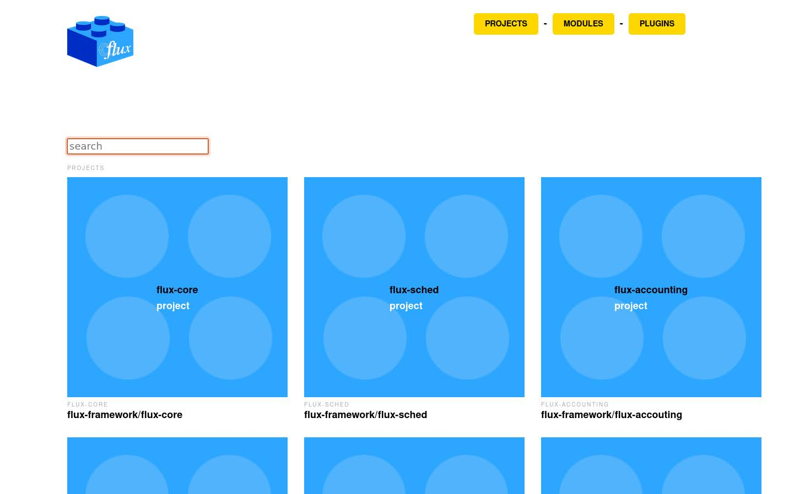

# Flux Architecture

Here we are collecting metadata and intending to create visualizations of the architecture.

## Desired Steps

1. First, we need to define components, plugins, modules, and projects under [_data](_data)
2. From that, we'd like to make:
 - A "legos" design searchable table or UI to be able to quickly browse and find a component and a link to where it is.
 - A circle packing plot that shows where plugins/modules live based on projects (for informational purposes)
 - Architecture diagrams of several types

Our WIP interfaces can be seen at [https://converged-computing.github.io/flux-architecture/](https://converged-computing.github.io/flux-architecture/).
We are currently working on the content here (plugins, modules, and projects described and descriptions)
and will move to plots and charts and more complex diagrams after that.

**under development**

## License

HPCIC DevTools is distributed under the terms of the MIT license.
All new contributions must be made under this license.

See [LICENSE](https://github.com/converged-computing/cloud-select/blob/main/LICENSE),
[COPYRIGHT](https://github.com/converged-computing/cloud-select/blob/main/COPYRIGHT), and
[NOTICE](https://github.com/converged-computing/cloud-select/blob/main/NOTICE) for details.

SPDX-License-Identifier: (MIT)

LLNL-CODE- 842614
